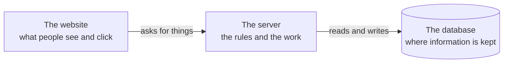

# claude-project-template

A starting point for building a web app with Claude.

This template is a already set up with good rules for development so the code is written similarly to how our main apps are developed.

It gives you the three pieces almost every web app needs:

Plus a shared rulebook, [CLAUDE.md](CLAUDE.md), that tells Claude how this project is organised and how to keep it tidy as it grows.

## Start your own project from it

1. Click the green **Use this template** button at the top of this page, then choose **Create a new repository**.
2. Give your project a name and create it. You now have your own copy — the original is untouched.
3. Open your new project in Claude Code and tell it what you want to build.

Claude can handle the setup from there: installing what the project needs, starting the database, and getting it running on your machine. If you'd like to do that part yourself, the exact commands are in [CLAUDE.md](CLAUDE.md).

## Good first things to ask Claude

- Install this project on locally so I can develop and write tests on my computer
- Install my app on <vegaverse URL>  First step to do this is merge in the lyra code branch on this repo.
- Add Authentication using <arcturus URL>

## What you'll need

- A [GitHub](https://github.com) account, to make your copy.
- [Claude Code](https://claude.com/claude-code) on your computer.
